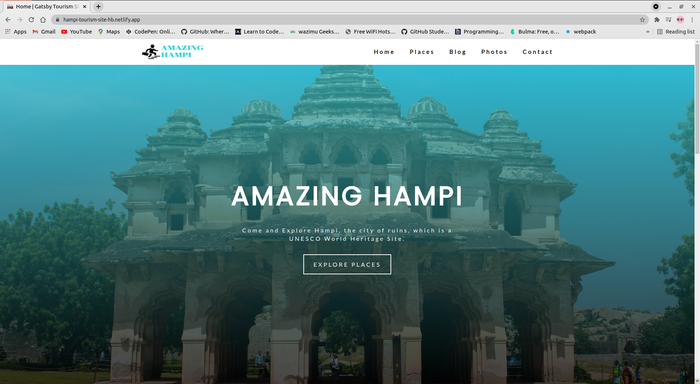
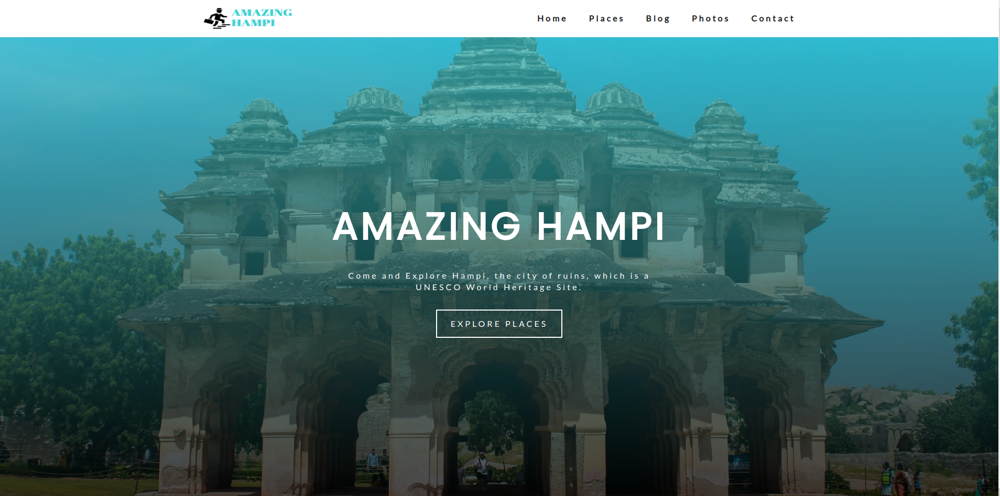
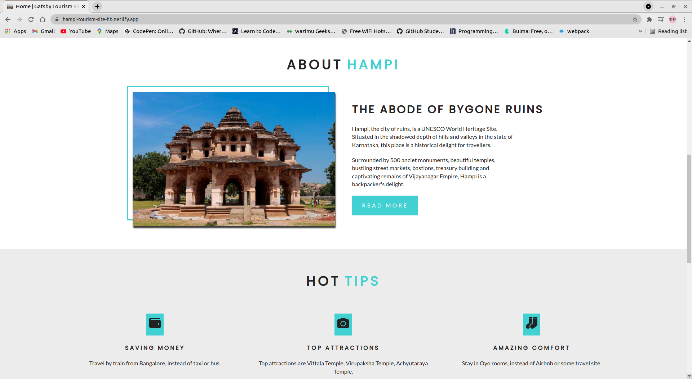
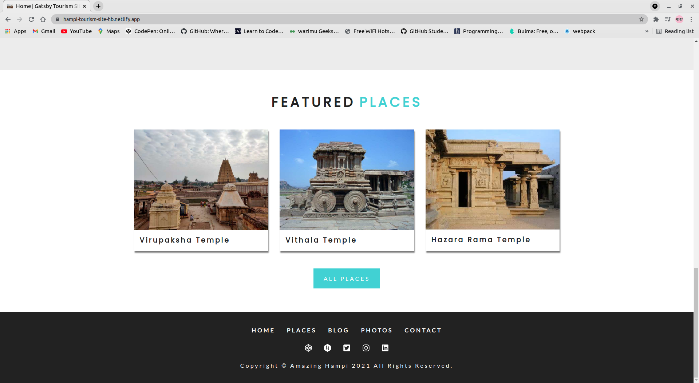
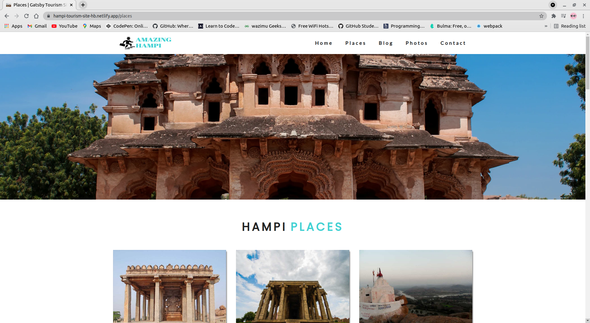
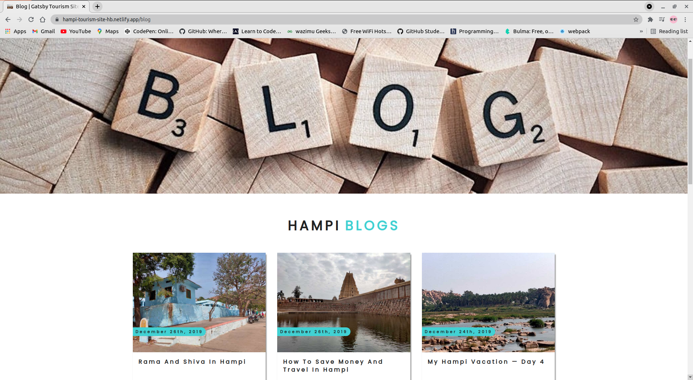
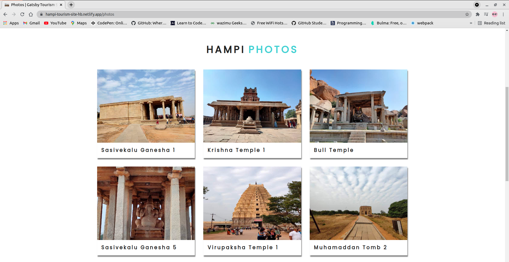
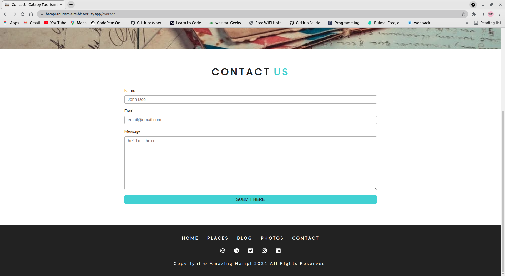

  

Hampi Tourism site, this is a blog site for briefing tourists interested to visit the place in India.

## Technologies
 
- JavaScript  
  &#10004;React - Frontend 
  &#10004; Gatsby - Static Site Generator 
  &#10004; Node - Backend 
- Contentful CMS 
  &#10004; (store images and posts of the site) 
- Formspree 
  &#10004; Sends emails to my gmail account 
- GraphQL 
  &#10004; Querrying Contentful CMS data 

## Demo

## Home

## About

## Featured Places

## Places

## Blogs

## Photos

## Contact Us

